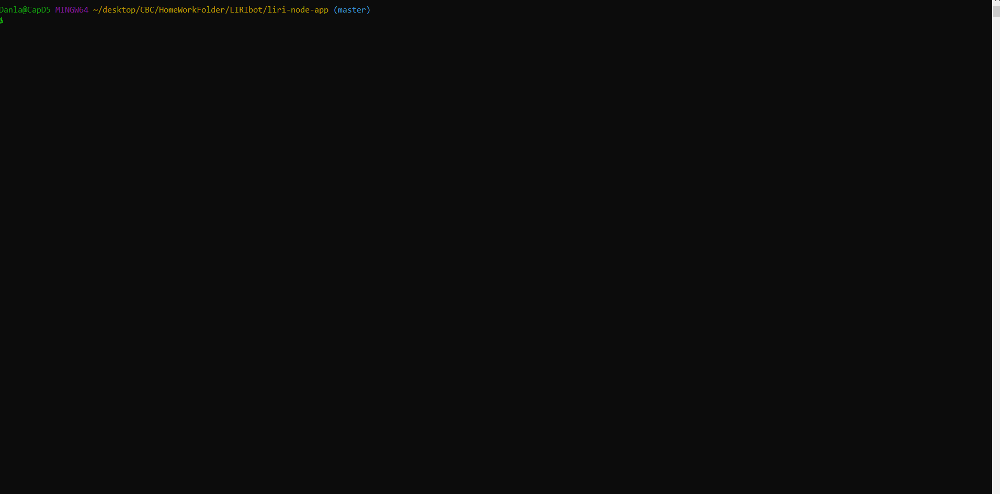

# LIRI Bot - Command Line Node App

## Overview
This LIRI bot will search Bands in Town for concerts, Spotify for songs, and OMDB for movies.
 
 

 
 

## How to Use

This app takes in 1 of 3 commands at a time.

## Commands
### 1. concert
###### Info
Name of Concert  
Location  
Date
### 2. song
###### Info
Artist  
Song  
Album  
Preview Link
### 3. movie
###### Info
Title  
Year Released  
IMDB Rating  
Rotten Tomatoes Rating  
Production Location  
Languages  
Plot  
Actors 

## NPMs Used
axios  
Node-Spotify-API  
Moment  
DotEnv  

## What You Need To Run The App
The Spotify API requires you sign up as a developer to generate the necessary credentials. You can follow these steps in order to generate a client id and client secret:
 
 
Step 1:   Visit https://developer.spotify.com/my-applications/#!/
 
 
Step 2:   Either login to your existing Spotify account or create a new one (a free account is fine) and log in.
 
 
Step 3:   Once logged in, navigate to https://developer.spotify.com/my-applications/#!/applications/create to register a new application to be used with the Spotify API. You can fill in whatever you'd like for these fields. When finished, click the "complete" button.
 
 
Step 4:   On the next screen, scroll down to where you see your client id and client secret. Copy these values down somewhere, you'll need them to use the Spotify API and the node-spotify-api package.
 
 
Spotify API keys  
**SPOTIFY_ID=your-spotify-id**  
**SPOTIFY_SECRET=your-spotify-secret**  
inside of the .env file

